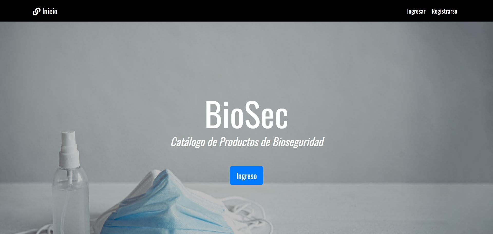
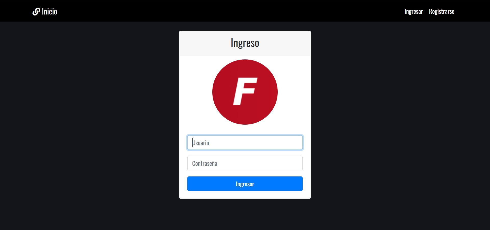
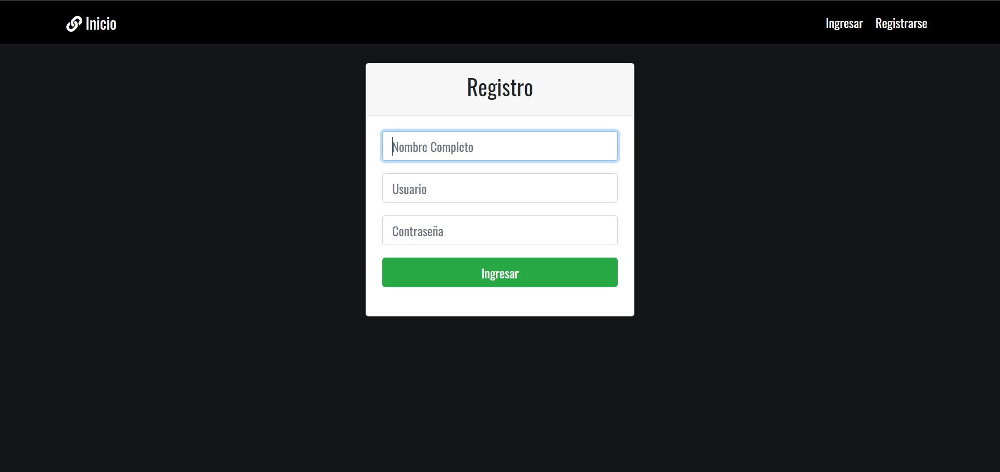

# BioSec - aplicación con Angular, Express, Nodejs y Mysql

Esta aplicación es una página multipropósito usando las tecnologías y/o frameworks Angular, Express, Nodejs y Mysql. El propósito de esta aplicación web, es ser un ejemplo para MISIONTIC 2022.

## Instalación

mysql -u currentUser -p currentPassword ./database/db.sql # create database
npm i
npm run build
npm start

## Estructura

- database, en esta encontramos el script de creación y consultas para generar la base de datos para esta aplicación.
- src, es todo el código para el Backend y Fontend de la aplicación.
- docs

## Puerto del despliegue

- PORT '82'

## Herramientas usadas

- Angular
- Express
- Nodejs
- Mysql

# Recursos

- https://stackoverflow.com/questions/50093144/mysql-8-0-client-does-not-support-authentication-protocol-requested-by-server
